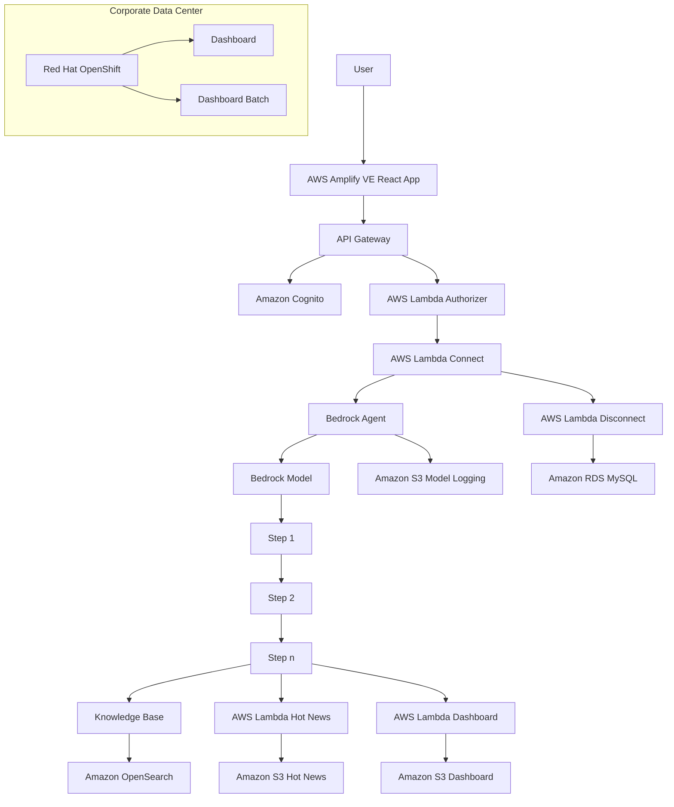
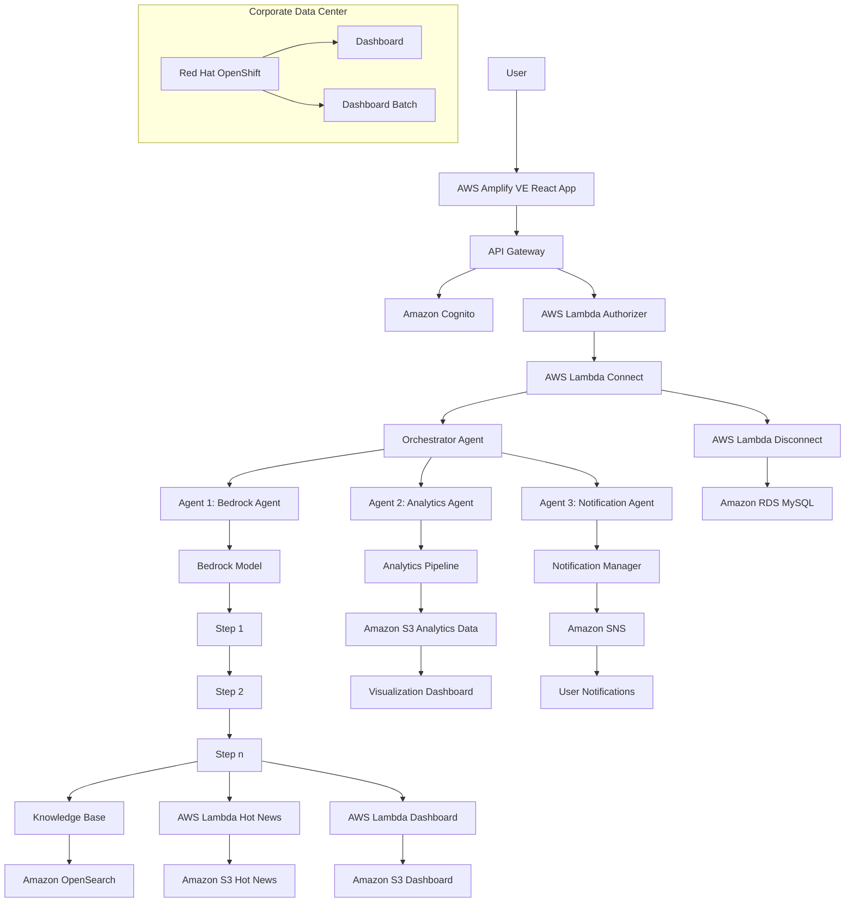
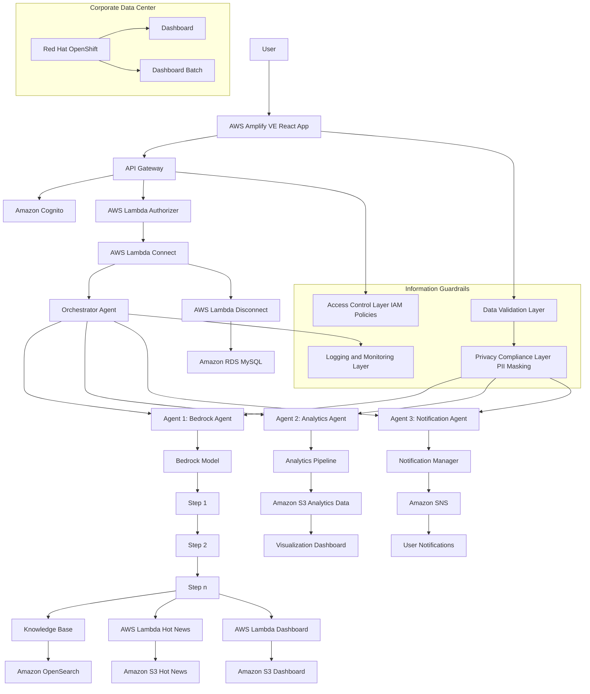

# Exploring AWS Architectures: Base, Orchestrator, and Compliance-Enhanced Systems

In this blog, we delve into three distinct architectures built on AWS: the **Base System**, the **Orchestrator System** with multi-agent technology, and the **Compliance-Enhanced System** with robust information guardrails. Each system is designed to meet different levels of complexity and compliance requirements. Below, we outline the purpose, scope, and detailed architecture of each system.

---

## Base System

### Overview
The Base System represents a foundational architecture leveraging AWS services to build a robust and scalable system. This architecture is designed to handle basic workflows and interactions efficiently.

### Scope
This system is suitable for:
- Handling standard user interactions
- Basic data processing
- Minimal compliance or guardrails

### Use Case: Chatbot for a Business
In this architecture, a chatbot is deployed to interact with customers, handle FAQs, and log data for future analysis. The chatbot uses the Bedrock Model for understanding and generating responses, with a basic flow for interactions.

### Architecture

---

## Orchestrator System

### Overview
The Orchestrator System introduces multi-agent technology, enabling intelligent decision-making and task distribution. The orchestrator acts as a central control entity, delegating responsibilities to specialized agents.

### Scope
This system is suitable for:
- Complex workflows involving multiple specialized tasks
- Advanced decision-making and delegation
- Scalable systems requiring dynamic task orchestration

### Use Case: Chatbot with Dynamic Features
In this architecture, the chatbot is enhanced to handle dynamic workflows, such as analytics, notifications, and personalized responses. The orchestrator agent selects the best specialized agent (e.g., Bedrock for NLP, Analytics for data insights, Notifications for reminders) based on the user query.

### Architecture

---

## Compliance-Enhanced System

### Overview
The Compliance-Enhanced System builds upon the orchestrator model, incorporating robust guardrails to manage data securely and meet compliance requirements. These guardrails include validation, access control, logging, and privacy measures.

### Scope
This system is suitable for:
- Highly regulated industries (e.g., finance, healthcare)
- Systems requiring strict data governance and audit trails
- Advanced workflows with a focus on secure information management

### Use Case: Compliance-Focused Chatbot
In this architecture, the chatbot is designed for businesses in regulated industries. It ensures data privacy, access control, and full auditability. For example, a healthcare chatbot answering patient questions while adhering to HIPAA regulations.

### Architecture

---

### Conclusion
These three architectures provide a progression from a basic, functional system to a sophisticated, compliance-focused solution. By leveraging AWS services and incorporating orchestrator agents and compliance guardrails, organizations can scale their systems and meet the demands of complex workflows while adhering to strict data governance requirements. Choose the architecture that aligns with your current and future needs to ensure efficiency, scalability, and security.

