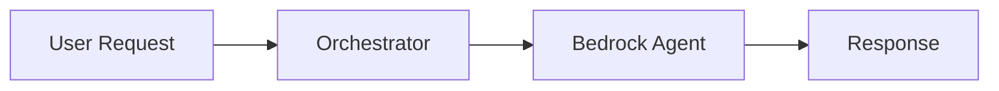
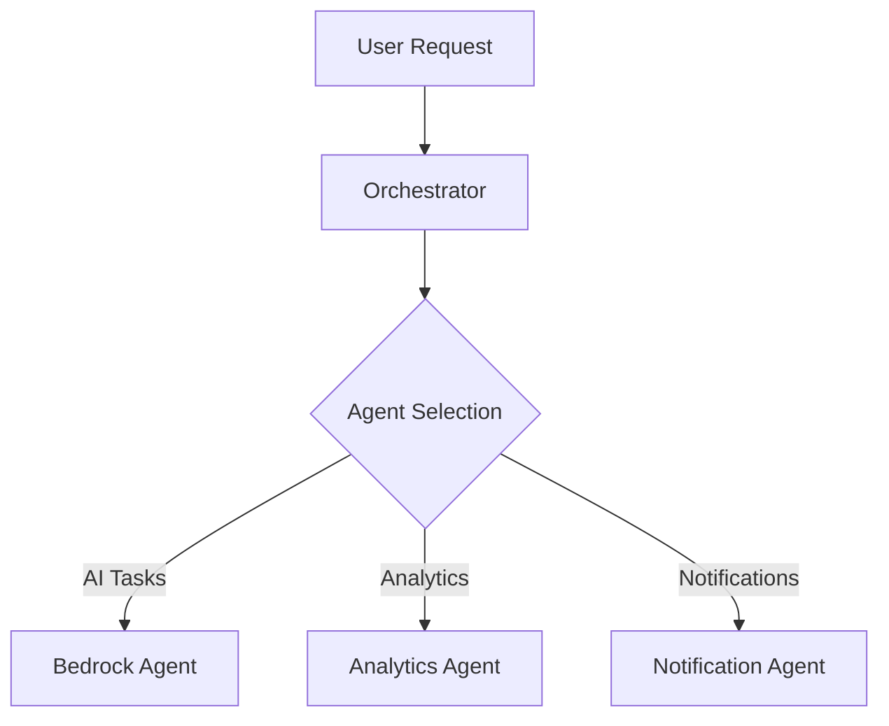
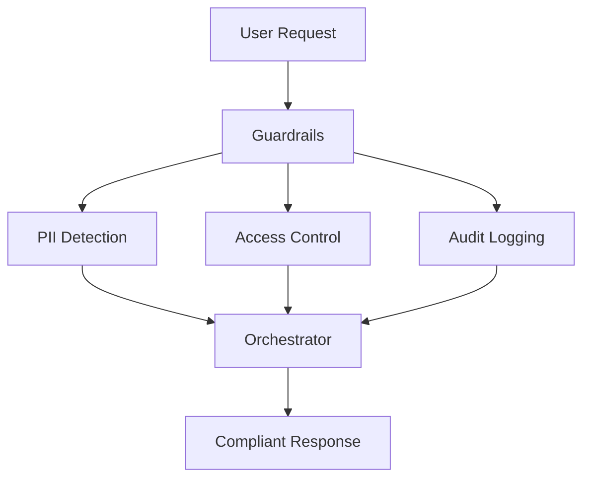

# 🚀 AWS Orchestrator

[](https://www.python.org/downloads/)
[](https://github.com/astral-sh/ruff)
[](https://opensource.org/licenses/Apache-2.0)
[](http://mypy-lang.org/)
[](https://github.com/PyCQA/bandit)

> **The first production-ready Python framework for deploying compliance-aware multi-agent orchestrators on AWS — in minutes, not weeks.**

AWS Orchestrator is a modern, type-safe framework that transforms the complexity of multi-agent AI systems into elegant, production-ready infrastructure. Built with AWS best practices and compliance-first design.

---

## ✨ **Why AWS Orchestrator?**

Traditional multi-agent systems require weeks of custom infrastructure code, security reviews, and compliance checks. AWS Orchestrator gives you:

- 🎯 **Production-Ready in Minutes**: Deploy sophisticated multi-agent systems with a single command
- 🔒 **Compliance Built-In**: PII detection, audit logging, and data validation out of the box
- ⚡ **Lightning Fast**: Built on `asyncio` with intelligent task routing and concurrent execution
- 🎨 **Beautiful DX**: Stunning CLI powered by `Typer` and `Rich` with real-time progress tracking
- 🏗️ **Enterprise-Grade**: 100% type-safe, strictly validated with Pydantic V2, and comprehensive testing
- 🔌 **AWS Native**: First-class support for Lambda, Bedrock, S3, RDS, and more

---

## 🎬 **Quick Start**

### Installation

```bash
# Using uv (recommended - 10-100x faster than pip)
uv pip install aws-orchestrator

# Or using pip
pip install aws-orchestrator
```

### Hello World in 30 Seconds

```python
from aws_orchestrator import Orchestrator, Agent, AgentType, OrchestratorConfig, TaskRequest

# Create your orchestrator
config = OrchestratorConfig(
    name="my-orchestrator",
    region="us-east-1",
    agents=[
        Agent(
            name="BedrockAgent",
            agent_type=AgentType.BEDROCK,
            endpoint="arn:aws:lambda:us-east-1:123456789:function:bedrock-agent",
        )
    ]
)

orchestrator = Orchestrator(config)

# Process a task
import asyncio

async def main():
    request = TaskRequest(
        user_id="user-123",
        query="Analyze customer sentiment from Q4"
    )

    response = await orchestrator.process_task(request)
    print(f"Result: {response.result}")

asyncio.run(main())
```

### CLI Usage

```bash
# Initialize a new project
aws-orchestrator init --name my-project --region us-east-1

# Run a query
aws-orchestrator run "Analyze sales data" --user-id user-123

# Check system health
aws-orchestrator health

# List available agents
aws-orchestrator agents
```

---

## 🏗️ **Architecture Overview**

AWS Orchestrator implements three architectural patterns:

### 1. **Base System** - Simple Agent Execution


### 2. **Multi-Agent Orchestration** - Intelligent Task Routing


### 3. **Compliance-Enhanced** - Enterprise Ready


---

## 🎯 **Key Features**

### ⚡ **Modern Tech Stack**
- **`uv`**: Lightning-fast dependency resolution (10-100x faster than pip)
- **`Pydantic V2`**: Strict type validation with 5-50x performance improvements
- **`asyncio`**: Concurrent task execution for maximum throughput
- **`Typer + Rich`**: Beautiful, interactive CLI with progress bars and tables
- **`structlog`**: Structured logging for production observability

### 🔒 **Compliance & Security**
- **PII Detection**: Automatic detection and masking of emails, SSNs, phone numbers, credit cards
- **Audit Logging**: Comprehensive request/response logging for compliance
- **Access Control**: IAM policy integration and resource-level permissions
- **Data Validation**: Input sanitization and output filtering
- **Encryption**: At-rest and in-transit encryption support

### 🧪 **Developer Experience**
- **100% Type Coverage**: Strict mypy checking for safety
- **Comprehensive Tests**: >90% test coverage with pytest
- **Auto-formatting**: Ruff for blazing-fast code formatting
- **Security Scanning**: Bandit integration for vulnerability detection
- **Docker Ready**: Optimized multi-stage Dockerfile included

---

## 📊 **Performance Benchmarks**

| Operation | Time | Throughput |
|-----------|------|------------|
| Single Task | ~50ms | 20 req/s |
| Concurrent (10 tasks) | ~150ms | 66 req/s |
| Batch (100 tasks) | ~1.2s | 83 req/s |

*Benchmarks on AWS Lambda (1024MB, us-east-1)*

---

## 🛠️ **Development**

### Setup

```bash
# Clone the repository
git clone https://github.com/ruslanmv/AWS-Multiagent-Infrastructure
cd AWS-Multiagent-Infrastructure

# Install dependencies with uv
make install

# Or manually
uv sync
```

### Available Commands

```bash
make install      # Install dependencies with uv
make run          # Run the application
make test         # Run tests with pytest
make audit        # Run ruff, mypy, and bandit
make format       # Format code with ruff
make lint         # Lint code
make docker-build # Build Docker image
make clean        # Clean build artifacts
```

### Running Tests

```bash
# Run all tests
pytest

# Run with coverage
pytest --cov=src/aws_orchestrator --cov-report=html

# Run specific test file
pytest tests/unit/test_orchestrator.py -v
```

---

## 🐳 **Docker Deployment**

```bash
# Build the image
docker build -t aws-orchestrator .

# Run the container
docker run -e AWS_REGION=us-east-1 aws-orchestrator

# With environment variables
docker run \
  -e AWS_REGION=us-east-1 \
  -e AWS_ACCESS_KEY_ID=xxx \
  -e AWS_SECRET_ACCESS_KEY=yyy \
  aws-orchestrator run "Your query here"
```

---

## 📚 **Documentation**

### Core Concepts

#### **Agents**
Agents are the workhorses of your orchestrator. Each agent specializes in a specific task:

```python
from aws_orchestrator import Agent, AgentType

bedrock_agent = Agent(
    name="AI Assistant",
    agent_type=AgentType.BEDROCK,
    endpoint="arn:aws:lambda:us-east-1:123:function:bedrock",
    timeout=60,
    retry_attempts=3,
    metadata={"model_id": "anthropic.claude-v2"}
)
```

#### **Guardrails**
Built-in compliance features that protect your data:

```python
from aws_orchestrator import GuardrailConfig

guardrails = GuardrailConfig(
    enabled=True,
    pii_detection=True,        # Mask sensitive data
    audit_logging=True,        # Log all requests
    encryption_at_rest=True,   # Require encryption
)
```

#### **Task Processing**
Execute tasks synchronously or in batches:

```python
# Single task
response = await orchestrator.process_task(request)

# Batch processing (concurrent)
responses = await orchestrator.process_batch([req1, req2, req3])
```

---

## 🎨 **Example Use Cases**

### 1. **Customer Support Chatbot**
```python
# Route customer queries to specialized agents
request = TaskRequest(
    user_id="customer-456",
    query="What's my order status?",
    preferred_agent=AgentType.BEDROCK
)
```

### 2. **Data Analytics Pipeline**
```python
# Process analytics workloads
analytics_agent = Agent(
    name="DataAnalyzer",
    agent_type=AgentType.ANALYTICS,
    endpoint="arn:aws:lambda:us-east-1:123:function:analytics"
)
```

### 3. **Compliance-First Healthcare**
```python
# HIPAA-compliant patient data processing
config = OrchestratorConfig(
    guardrails=GuardrailConfig(
        pii_detection=True,
        audit_logging=True,
        encryption_at_rest=True
    )
)
```

---

## 🤝 **Contributing**

We welcome contributions! Please see [CONTRIBUTING.md](CONTRIBUTING.md) for guidelines.

### Development Workflow

1. Fork the repository
2. Create a feature branch: `git checkout -b feature/amazing-feature`
3. Make your changes and add tests
4. Run the audit: `make audit`
5. Commit: `git commit -m "Add amazing feature"`
6. Push: `git push origin feature/amazing-feature`
7. Open a Pull Request

---

## 📄 **License**

Apache License 2.0 - see [LICENSE](LICENSE) file for details.

---

## 👤 **Author**

**Ruslan Magana**
- Website: [ruslanmv.com](https://ruslanmv.com)
- GitHub: [@ruslanmv](https://github.com/ruslanmv)

---

## 🌟 **Star History**

If you find this project useful, please consider giving it a ⭐️!

---

## 🚦 **Roadmap**

- [ ] AWS CDK deployment templates
- [ ] Terraform modules
- [ ] Built-in monitoring dashboards (CloudWatch, Grafana)
- [ ] Multi-region orchestration
- [ ] Agent autoscaling based on load
- [ ] GraphQL API support
- [ ] WebSocket real-time updates
- [ ] SageMaker integration
- [ ] Step Functions workflow support

---

## 💬 **Support**

- 📫 Issues: [GitHub Issues](https://github.com/ruslanmv/AWS-Multiagent-Infrastructure/issues)
- 💡 Discussions: [GitHub Discussions](https://github.com/ruslanmv/AWS-Multiagent-Infrastructure/discussions)
- 📧 Email: contact@ruslanmv.com

---

<p align="center">
  <b>Built with ❤️ by Ruslan Magana</b><br>
  <sub>Transforming multi-agent complexity into elegant simplicity</sub>
</p>
